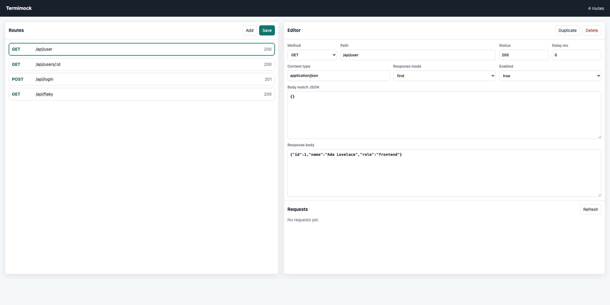

# Termimock

Termimock is a terminal API mock server with a TUI. Define mock REST endpoints from your terminal while the HTTP server is already running, then point your frontend at it immediately.

Most mock tools make you switch to a GUI, export config, or restart a process. Termimock keeps the control panel and the mock server together in one terminal session.



## Features

- Live local HTTP server and terminal UI in the same process
- Add, edit, duplicate, delete, enable, and disable mock endpoints
- Match by HTTP method and path
- Custom status code, content type, response body, and headers
- Path parameters such as `/api/users/:id` or `/api/users/{id}`
- Response templates such as `{{params.id}}`, `{{query.q}}`, `{{method}}`, and `{{path}}`
- Per-route latency simulation
- Multiple responses per route with `first`, `cycle`, or `random` selection
- JSON request body matching with fields like `email` or `user.email`
- Request log visible inside the TUI
- Built-in browser GUI at `/_termimock`
- Save and load endpoint definitions as JSON
- Hot reload route files while the server is running
- Import starter routes from OpenAPI JSON
- Headless mode for CI, demos, and scripted frontend work
- Zero runtime dependencies

## Install

```bash
python3 -m pip install -e .
```

## Run the TUI

```bash
termimock
```

By default the server listens on `http://127.0.0.1:8080`.

```bash
termimock --host 127.0.0.1 --port 9000 --file examples/sample-routes.json
```

## Run Without the TUI

```bash
termimock --headless --file examples/sample-routes.json
```

Open the built-in GUI:

```text
http://127.0.0.1:8080/_termimock
```

The GUI lets you add, edit, duplicate, delete, enable, disable, and save routes from a browser while the mock server keeps running.

Route files reload automatically when changed. Use `--no-watch` to disable that behavior.

## Import OpenAPI

Generate a starter route file from an OpenAPI JSON document:

```bash
termimock --import-openapi openapi.json --file routes.json
```

Then run it:

```bash
termimock --file routes.json
```

Then test it:

```bash
curl http://127.0.0.1:8080/api/user
```

Try a templated route:

```bash
curl "http://127.0.0.1:8080/api/users/42?tab=settings"
```

If port `8080` is already busy, choose another port:

```bash
termimock --headless --port 9000 --file examples/sample-routes.json
```

## TUI Shortcuts

| Key | Action |
| --- | --- |
| `a` | Add endpoint |
| `e` | Edit selected endpoint |
| `d` | Delete selected endpoint |
| `c` | Clone selected endpoint |
| `space` | Enable or disable selected endpoint |
| `s` | Save routes |
| `r` | Reload routes from disk |
| `j` / `k` or arrows | Move selection |
| `q` | Quit |

## Route File Format

```json
{
  "routes": [
    {
      "method": "GET",
      "path": "/api/user",
      "status": 200,
      "content_type": "application/json",
      "headers": {
        "X-Mock": "termimock"
      },
      "body": "{\"id\":1,\"name\":\"Ada\"}",
      "delay_ms": 0,
      "enabled": true
    }
  ]
}
```

Path parameters can use either `:id` or `{id}` syntax. Response bodies can reference `{{params.id}}`, `{{query.name}}`, `{{method}}`, and `{{path}}`.

Routes can also define response variants:

```json
{
  "method": "GET",
  "path": "/api/flaky",
  "response_mode": "cycle",
  "responses": [
    {
      "status": 200,
      "content_type": "application/json",
      "headers": {},
      "body": "{\"ok\":true}"
    },
    {
      "status": 500,
      "content_type": "application/json",
      "headers": {},
      "body": "{\"ok\":false}"
    }
  ]
}
```

POST routes can match JSON request bodies:

```json
{
  "method": "POST",
  "path": "/api/login",
  "body_match": {
    "email": "admin@test.com"
  },
  "body": "{\"token\":\"dev-token\",\"email\":\"{{body.email}}\"}"
}
```

## Project Status

This is an early, hackable version meant to prove the idea cleanly. Good next features are latency simulation, path parameters, request body matching, response presets, import from OpenAPI, and a richer route editor.

## Development

```bash
PYTHONPATH=src python3 -m unittest discover -s tests
```
